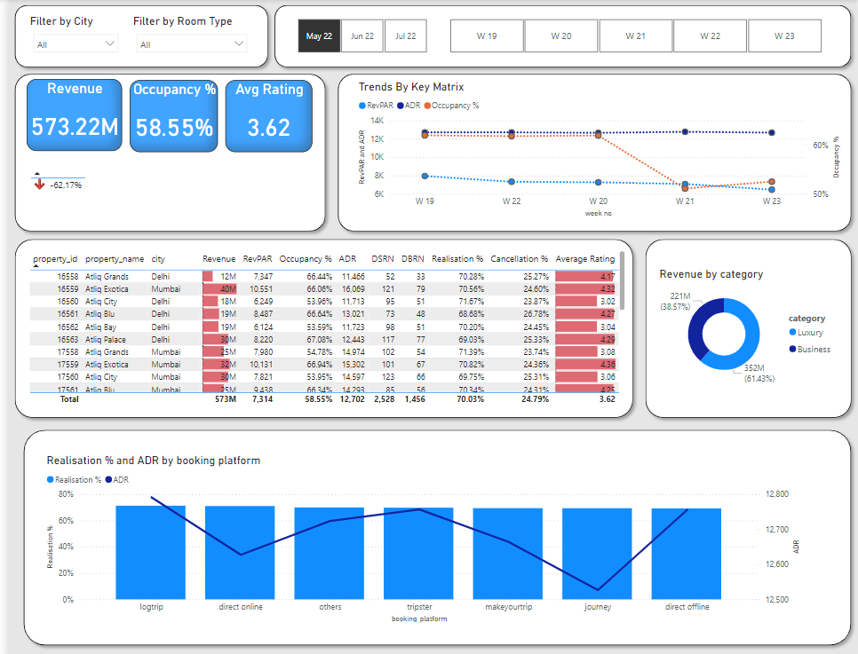

# Atliq Grands Power BI Report - Hospitality Domain

Welcome to my first Data Analysis project! This repository showcases a Power BI report I created for Atliq Grands, an imaginary luxury hotel group. The report provides insights into the hotel's performance and operational metrics.

---

## 📊 Project Description

The Atliq Grands Power BI report is designed to analyze key metrics such as revenue, occupancy rates, customer satisfaction, and booking trends across various hotel locations. The report aims to help hotel management make informed decisions.

---

## ✨ Features of the Report

- **Revenue Analysis:** Monthly and yearly revenue trends with comparisons.
- **Occupancy Rates:** Insights into room occupancy across locations.
- **Customer Feedback:** Analysis of guest satisfaction ratings.
- **Booking Trends:** Seasonal trends and peak booking periods.
- **Interactive Dashboards:** Dynamic filters and slicers for in-depth exploration.

---

## 🛠️ Tools and Tech Stack

- **Power BI Desktop:** For building interactive visualizations and dashboards.
- **Excel:** Data preparation and cleaning.
- **Fictional Dataset:** Generated for analysis purposes.

---

## 📁 Dataset Overview

The dataset includes:
- **Hotel ID**: Unique identifier for each hotel.
- **Location**: City of the hotel.
- **Revenue**: Monthly revenue data.
- **Bookings**: Number of room bookings.
- **Customer Rating**: Guest satisfaction score (1-5 scale).

> **Note**: The dataset is fictional and created for learning purposes.

---

## 🖼️ Screenshots

### Dashboard Overview

> More visuals can be found in the Power BI report.

---
## 🚀 How to View the Report

1. Clone this repository to your local machine.
2. Download and install [Power BI Desktop](https://powerbi.microsoft.com/).
3. Open the `Atliq_Grands_Report.pbix` file in Power BI Desktop.

---

## 💡 Key Learnings

- Learned to create interactive visualizations in Power BI.
- Improved understanding of data cleaning and transformation.
- Gained insights into hotel business metrics and KPIs.

---

## 📝 Author

**Premkumar Patel**  
Aspiring Data Analyst | Learning Power BI and Data Analysis

Feel free to connect with me on [LinkedIn](https://www.linkedin.com/in/premkumarpatel/) or explore my other projects.

---
